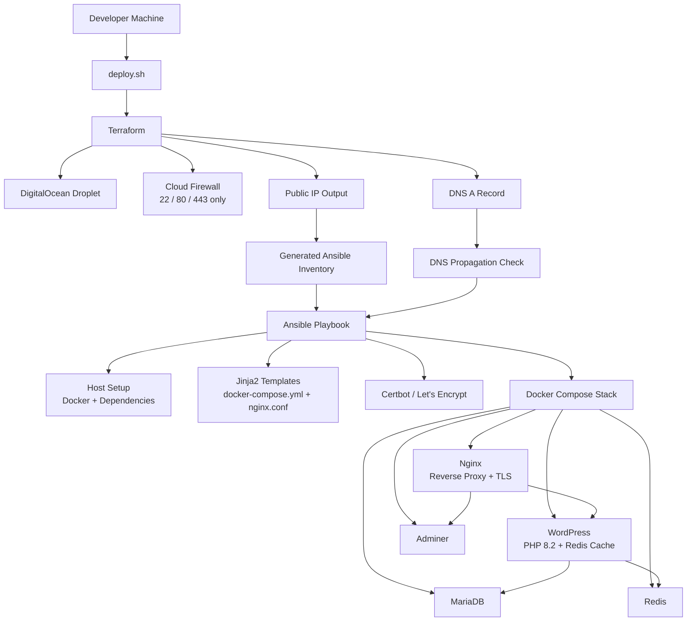

# Cloud-1

Automated cloud deployment pipeline using **Terraform**, **Ansible**, **Docker Compose**, **Nginx**, and **Let's Encrypt**.

Cloud-1 provisions a DigitalOcean server from scratch, configures the host, deploys a multi-container web stack, manages DNS, and bootstraps HTTPS certificates through an idempotent infrastructure workflow.

## Overview

Cloud-1 is a platform engineering project focused on reproducible cloud deployments.

It automates the full path from an empty DigitalOcean account to a running HTTPS web platform:

* Terraform provisions the cloud infrastructure.
* Bash connects Terraform outputs to Ansible.
* Ansible configures the server and templates deployment files.
* Docker Compose runs the application stack.
* Nginx handles reverse proxying and TLS termination.
* Certbot manages the Let's Encrypt certificate lifecycle.

The project was designed to practice real-world deployment concerns: infrastructure-as-code, configuration management, DNS propagation, reverse proxy bootstrapping, container health checks, persistent volumes, and secure network exposure.

## Architecture



## What This Project Demonstrates

### Infrastructure as Code

Terraform provisions:

* DigitalOcean Droplet
* SSH key attachment
* Cloud firewall rules
* DNS A record
* Project assignment
* Public IP output for downstream automation

### Idempotent Configuration Management

Ansible handles:

* Host dependency installation
* Docker setup
* Directory and volume creation
* Service configuration
* Jinja2 templating
* Docker Compose orchestration
* Certificate issuance and renewal

### Dynamic TLS Bootstrapping

Cloud-1 solves the common first-deploy HTTPS problem:

1. Nginx starts in HTTP-only ACME challenge mode.
2. Certbot requests a Let's Encrypt certificate using the webroot challenge.
3. Ansible detects certificate availability.
4. Nginx is re-templated with the HTTPS server block.
5. Nginx reloads into TLS mode.
6. A renewal cron job keeps certificates valid.

### DNS-Aware Deployment

The top-level deployment script does not blindly run Ansible after Terraform.

It extracts the Droplet IP, updates the Ansible inventory, then waits for DNS propagation before attempting certificate issuance. This prevents failures where Let's Encrypt validates a domain before the new DNS record resolves correctly.

### Containerized Service Stack

The deployed stack follows a one-container-per-process model:

| Service   | Purpose                           |
| --------- | --------------------------------- |
| Nginx     | TLS termination and reverse proxy |
| WordPress | Web application / CMS             |
| MariaDB   | Relational database               |
| Redis     | Cache layer                       |
| Adminer   | Database administration UI        |

Docker Compose health checks and conditional dependencies ensure services start in the correct order.

## Tech Stack

### Cloud and Infrastructure

* DigitalOcean
* Terraform
* DigitalOcean Terraform Provider
* DNS A records
* Cloud firewalls

### Automation

* Ansible
* Bash
* Jinja2 templates

### Runtime

* Docker
* Docker Compose v2
* Nginx
* WordPress
* MariaDB
* Redis
* Adminer

### Security and TLS

* Let's Encrypt
* Certbot
* HTTPS reverse proxying
* Firewall-restricted ingress
* SSH key authentication

## Repository Structure

```text
Cloud-1/
├── terraform/
│   ├── main.tf              # DigitalOcean infrastructure
│   ├── variables.tf         # Terraform inputs
│   └── outputs.tf           # Public IP output
│
├── ansible/
│   ├── inventory/
│   │   └── hosts.ini        # Generated/updated target inventory
│   ├── group_vars/
│   │   └── all.yml          # Deployment variables
│   ├── roles/
│   │   ├── setup/           # Host dependencies and Compose template
│   │   ├── certificates/    # Certbot / Let's Encrypt lifecycle
│   │   ├── nginx/           # Reverse proxy configuration
│   │   ├── wordpress/       # WordPress deployment
│   │   ├── mariadb/         # Database service
│   │   ├── redis/           # Cache service
│   │   └── adminer/         # Database admin UI
│   ├── playbook.yml         # Main Ansible entrypoint
│   └── clean_up.yml         # Targeted cleanup tasks
│
├── srcs/
│   └── requirements/
│       ├── nginx/
│       ├── wordpress/
│       ├── mariadb/
│       ├── redis/
│       └── adminer/
│
├── setup.sh                 # Local dependency setup
├── deploy.sh                # Full Terraform → Ansible deployment pipeline
├── destroy.sh               # Terraform teardown
├── .env.example             # Example environment variables
└── README.md
```

## Deployment Flow

```text
setup.sh
   ↓
.env / Ansible variables
   ↓
deploy.sh
   ↓
Terraform apply
   ↓
DigitalOcean Droplet + Firewall + DNS
   ↓
Terraform public IP output
   ↓
Generated Ansible inventory
   ↓
DNS propagation check
   ↓
Ansible playbook
   ↓
Docker Compose stack
   ↓
Nginx HTTP ACME mode
   ↓
Certbot certificate issuance
   ↓
Nginx HTTPS mode
   ↓
WordPress + Adminer available over TLS
```

## Requirements

Install local dependencies:

```bash
sudo apt update
sudo apt install -y terraform ansible python3-pip python3-passlib
pip3 install docker docker-compose docker-py
```

You also need:

* A DigitalOcean account
* A DigitalOcean API token
* An SSH key uploaded to DigitalOcean
* A domain managed by DigitalOcean DNS or pointed to DigitalOcean nameservers

Generate an SSH key if needed:

```bash
ssh-keygen -t ed25519 -C "your_email@example.com"
```

## Configuration

Copy the example environment file:

```bash
cp .env.example .env
```

Fill in your cloud and application settings:

```bash
DO_TOKEN="your_digitalocean_token"
SSH_NAME="your_digitalocean_ssh_key_name"
PROJECT_NAME="your_digitalocean_project_name"

BASE_DOMAIN="example.com"
SUBDOMAIN="www"

SSH_USER="root"
VM_NAME="cloud-1"
REGION="fra1"

MARIADB_ROOT_PASSWORD="change_me"
MARIADB_USER="wordpress"
MARIADB_USER_PASSWORD="change_me"
MARIADB_DATABASE="wordpress"

WP_URL="https://www.example.com"
WP_TITLE="Cloud-1"
WP_ADMIN_USER="admin"
WP_ADMIN_PASSWORD="change_me"
WP_ADMIN_EMAIL="admin@example.com"
```

> Do not commit `.env` or real credentials.

## Deploy

Run the full deployment pipeline:

```bash
chmod +x deploy.sh
./deploy.sh
```

The script will:

1. Initialize and apply Terraform.
2. Provision the Droplet, firewall, DNS, and project assignment.
3. Extract the public IP from Terraform output.
4. Update the Ansible inventory.
5. Wait until the domain resolves to the new IP.
6. Run the Ansible playbook.
7. Build and start the Docker Compose stack.
8. Issue a Let's Encrypt certificate.
9. Reload Nginx into HTTPS mode.

## Destroy

To destroy the cloud infrastructure:

```bash
chmod +x destroy.sh
./destroy.sh
```

This removes the Terraform-managed DigitalOcean resources.

## Service URLs

After deployment:

```text
https://yourdomain.com
https://yourdomain.com/adminer
```

Depending on your domain configuration, the final URL may use the root domain or a subdomain such as:

```text
https://www.yourdomain.com
```

## Runtime Operations

SSH into the server:

```bash
ssh root@SERVER_IP
```

Check containers:

```bash
docker ps
```

View logs:

```bash
docker logs nginx
docker logs wordpress
docker logs mariadb
docker logs redis
docker logs adminer
```

Restart the stack:

```bash
docker compose -f /root/cloud-1/srcs/requirements/wordpress/docker-compose.yml restart
```

Stop the stack:

```bash
docker compose -f /root/cloud-1/srcs/requirements/wordpress/docker-compose.yml down
```

## Security Model

Cloud-1 applies several security controls:

* Cloud firewall restricts inbound traffic to ports `22`, `80`, and `443`.
* Backend services are not publicly exposed.
* Nginx is the only public application entrypoint.
* HTTPS is provisioned through Let's Encrypt.
* Database and WordPress data are stored in host-bound persistent volumes.
* SSH access uses key-based authentication.

## Known Limitations

This is a learning and portfolio infrastructure project, not a complete production platform.

Current limitations:

* Terraform state is stored locally.
* Secrets are managed through local configuration files.
* No automated offsite database backups.
* No centralized logging stack.
* No Prometheus/Grafana monitoring.
* SSH/root workflow could be hardened with a non-root deployment user.
* CI/CD integration is not included yet.

## Roadmap

Potential improvements:

* Add Terraform remote state backend.
* Encrypt secrets using Ansible Vault or SOPS.
* Add automated MariaDB backups to object storage.
* Add Prometheus and Grafana monitoring.
* Add GitHub Actions deployment workflow.
* Replace root SSH deployment with a restricted deploy user.
* Add smoke tests after deployment.

## Engineering Highlights

* Built a Terraform-to-Ansible deployment pipeline that provisions cloud infrastructure and immediately configures it.
* Implemented DNS-aware deployment sequencing to avoid certificate validation failures.
* Designed dynamic Nginx TLS bootstrapping for first-time Let's Encrypt issuance.
* Deployed a five-service Docker Compose stack with health checks and dependency ordering.
* Hardened public ingress with Terraform-managed firewall rules.
* Added persistent host volumes for database and WordPress state.
* Created repeatable deploy and destroy flows for controlling infrastructure lifecycle.

## Project Context

Cloud-1 was inspired by the 42 Network Inception project, but extends the idea from local container orchestration to real cloud infrastructure.

Instead of manually configuring a VPS, the entire lifecycle is automated:

```text
Provision → Configure → Deploy → Secure → Operate → Destroy
```

The project demonstrates the infrastructure side of full-stack engineering: deploying, securing, and operating the services that application platforms depend on.
